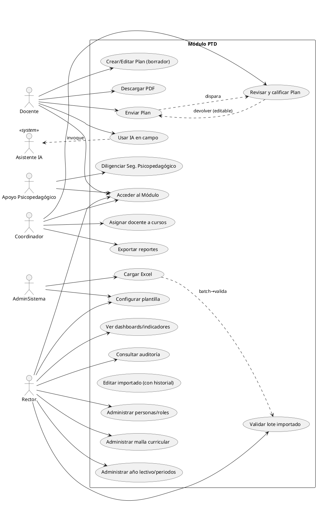

# Casos de Uso e Historias de Usuario

**Sistema:** PTD — Planes de Trabajo Docentes (IE Las Palmas)
**SRS de referencia:** `01-requerimientos/SRS-IEEE-29148.md`
**Versión:** 1.0 · **Fecha:** Julio 2026

---

## 1. Modelo de actores

| Actor | Descripción |
|---|---|
| **UsrInst** | Cualquier usuario autenticado del instituto (prioridad: entra por el portal). |
| **Docente** | Crea y diligencia sus Planes de Aula. |
| **Coordinador** | Coordina académicamente, evalúa Planes y asigna docentes a cursos. |
| **Rector** | Gobernanza general, permisos, parámetros, validación de históricos, dashboards. |
| **ApoyoPsico** | Apoyo Psicopedagógico; diligencia el bloque *Seguimiento Apoyo Psicopedagógico*. |
| **AdminSistema** | Administrador del Módulo (Rector o delegado) — carga Excel, configura IA. |
| **AsistenteIA** | Sistema (no humano). Cuando el Docente invoca IA sobre un campo. |

---

## 2. Casos de uso (UC)

> Notación: `UC-###`. Prioridad MoSCoW. Trazabilidad a RF del SRS.

### UC-001 — Acceder al Módulo desde el portal institucional
- **Actor:** UsrInst (cualquiera), Docente, Coordinador, Rector.
- **Precondición:** El usuario está autenticado en el portal institucional.
- **Flujo principal:**
  1. El usuario presiona el botón «Planes de Trabajo» del portal.
  2. El sistema reenvía la identidad (token/cookie SSO) al Módulo PTD.
  3. El Módulo valida la identidad con el `IdentityProvider`.
  4. Redirige al tablero correspondiente según rol/permisos.
- **Postcondición:** Sesión PTD activa con rol/permisos cargados.
- **Excepciones:** Identidad inválida → redirección a login del portal.
- **Prioridad:** Must · **RF**: RF-001, RF-002 · **Verificación**: Demostración (D).

### UC-002 — Administrar personas y roles (CRUD)
- **Actor:** Rector.
- **Precondición:** Rector autenticado con permiso `personas.manage`.
- **Flujo principal:**
  1. Listar personas con filtros.
  2. Crear/editar/desactivar una persona.
  3. Asignar uno o más roles + permisos.
- **Postcondición:** Entidad persistida con auditoría.
- **Prioridad:** Must · **RF**: RF-010, RF-040.

### UC-003 — Administrar malla curricular (grados, cursos, áreas, nodos, asignaturas)
- **Actor:** Rector, Coordinador (lectura), AdminSistema.
- **Precondición:** Permiso `malla.manage`.
- **Prioridad:** Must · **RF**: RF-012.

### UC-004 — Administrar años lectivos y periodos académicos
- **Actor:** Rector, Coordinador.
- **Prioridad:** Must · **RF**: RF-011.

### UC-005 — Asignar docente a curso/grado/asignatura/periodo
- **Actor:** Coordinador.
- **Precondición:** Docente y curso existen; año lectivo/periodo activo.
- **Flujo:**
  1. Coordinador abre el docente.
  2. Selecciona curso → grado → área/nodo/asignatura → periodo.
  3. Guarda asignaciones (puede marcar *dupla* con otro docente).
- **Postcondición:** Docente visualizará esos cursos/asignaturas/periodos en PTD.
- **Prioridad:** Must · **RF**: RF-013, RF-023.

### UC-006 — Configurar plantilla del Plan de Aula
- **Actor:** AdminSistema.
- **Precondición:** Permiso `plantilla.manage`.
- **Flujo:**
  1. Listar secciones/subsecciones del Plan.
  2. Habilitar/ocultar, marcar obligatoriedad, ordenar, versionar.
  3. Activar la nueva versión (los Planes existentes conservan la suya).
- **Prioridad:** Must · **RF**: RF-014, RF-015.

### UC-007 — Crear / editar / guardar borrador de Plan de Aula
- **Actor:** Docente.
- **Precondición:** Docente tiene asignación vigente para (curso, grado, asignatura, periodo).
- **Flujo:**
  1. Elige "Nuevo Plan" entre sus asignaciones.
  2. Diligencia encabezado (docentes, fechas, grado, N° semanas/clases, etc.).
  3. Completa las secciones (caracterización, competencias, indicadores, actividades/ejes, seguimientos, DUA).
  4. Guarda borrador (auto-guardado configurable).
- **Postcondición:** Plan en estado `BORRADOR` con auditoría de creación/edición.
- **Prioridad:** Must · **RF**: RF-020..RF-022.

### UC-008 — Enviar Plan a evaluación
- **Actor:** Docente.
- **Precondición:** Plan en `BORRADOR`, secciones obligatorias completas.
- **Flujo:**
  1. El docente presiona **Enviar**.
  2. El sistema valida campos obligatorios y coherencia (p. ej. sumar porcentajes de indicadores, N° clases).
  3. Cambia estado a `ENVIADO`; dispara notificación (`RF-060`) a Coordinación.
- **Postcondición:** Plan `ENVIADO`, no editable por el docente (solicita devolución si la requiere).
- **Prioridad:** Must · **RF**: RF-022, RF-060.

### UC-009 — Usar IA en un campo de texto del Plan
- **Actor:** Docente, AsistenteIA.
- **Precondición:** IA configurada y habilitada; permiso `ia.use`.
- **Flujo:**
  1. El docente posiciona el cursor en un campo editable (p. ej. "Caracterización", "Indicadores", "Seguimiento Docente").
  2. Selecciona una acción (borrador, mejorar, corregir, resumir, expandir, generar competencias/indicadores/observaciones, proponer actividades, preguntar).
  3. El Módulo construye un prompt acotado por (plantilla, contexto del Plan hasta ese punto, configuración de IA) y llama a `AIService`.
  4. El AsistenteIA retorna sugerencia(s) → vista *diff/sugerencia*; el docente acepta/edita/rechaza.
- **Postcondición:** El texto guardado es siempre responsabilidad del docente; trazabilidad de la invocación (modelo, tokens, costo).
- **Prioridad:** Must · **RF**: RF-024, RF-050..RF-053.

### UC-010 — Descargar PDF del Plan de Aula
- **Actor:** Docente, Coordinador.
- **Postcondición:** PDF con formato institucional, idéntico a la plantilla vigente.
- **Prioridad:** Must · **RF**: RF-025.

### UC-011 — Revisar Plan enviado (Coordinación)
- **Actor:** Coordinador.
- **Precondición:** Plan `ENVIADO` y en su jurisdicción.
- **Flujo:**
  1. Lista/abre Plan; ve historial y observaciones previas.
  2. Diligencia *Seguimiento Coordinación Académica* y marca pautas DUA.
  3. Califica → apruélelo/rechaza/devuelve; adjunta observación.
- **Postcondición:** Estado `APROBADO`/`RECHAZADO`/`DEVUELTO`; notificación al docente (`RF-060`).
- **Prioridad:** Must · **RF**: RF-031, RF-032, RF-060.

### UC-012 — Diligenciar Seguimiento Apoyo Psicopedagógico
- **Actor:** ApoyoPsico.
- **Postcondición:** Bloque almacenado y asociado al Plan, auditado.
- **Prioridad:** Should · **RF**: RF-082.

### UC-013 — Cargar archivo Excel (migración de históricos)
- **Actor:** AdminSistema / Rector.
- **Precondición:** Permiso `excel.import`.
- **Flujo:**
  1. Selecciona año lectivo destino y, opcionalmente, periodo.
  2. Sube archivo `.xlsx` (uno o varios periodos).
  3. El sistema:
     a. valida tipo/tamaño/firma;
     b. detecta hoja `FORMATO` + periodos `1°..n°`;
     c. valida estructura/campos/tipos/consistencia → *Reporte de validación*.
  4. Si no hay errores de bloqueo: previsualiza registros a importar.
  5. Confirma → crea `ImportBatch`, transforma y persiste en una transacción.
  6. Estado del batch: `PENDIENTE_VALIDACION`.
- **Postcondición:** Planes importados con `origin = IMPORTED`, `importBatchId`, metadatos de auditoría (RF-073).
- **Excepciones:** Errores de bloqueo → batch no creado, se entrega reporte descargable.
- **Prioridad:** Must · **RF**: RF-070..RF-074, RNF-035.

### UC-014 — Validar / aprobar lote importado (Rectoría)
- **Actor:** Rector.
- **Precondición:** Batch en `PENDIENTE_VALIDACION`.
- **Flujo:**
  1. Lista batches; abre uno → ve conteos y registros.
  2. Aprueba (`VALIDADO`) o Rechaza (`RECHAZADO` → revertido, sin eliminar la trazabilidad del intento).
- **Postcondición:** Registros disponibles para consulta/edición según RF-075.
- **Prioridad:** Must · **RF**: RF-042, RF-076.

### UC-015 — Editar registro importado sin perder historial
- **Actor:** Docente, Coordinador, AdminSistema.
- **Postcondición:** Cambio auditado, historial completo conservado, `origin` no cambia.
- **Prioridad:** Must · **RF**: RF-075, RF-081.

### UC-016 — Visualizar dashboards e indicadores
- **Actor:** Rector (global); Coordinador (su jurisdicción).
- **Postcondición:** KPIs calculados (docentes pendientes/aprobados, %, tiempo promedio, etc.) y gráficos (barras, circulares, línea de tiempo, KPI cards).
- **Prioridad:** Must · **RF**: RF-041.

### UC-017 — Exportar reportes
- **Actor:** Rector, Coordinador, Docente.
- **Salida:** PDF / Excel / CSV según objeto (Plan individual, listado de Planes, indicadores).
- **Prioridad:** Must · **RF**: RF-080.

### UC-018 — Consultar historial y auditoría
- **Actor:** Rector, AdminSistema.
- **Postcondición:** Visor de auditoría con filtros; detalle de cada cambio (diff).
- **Prioridad:** Must · **RF**: RF-081, RF-082.

---

## 3. Historias de Usuario (HU)

> Formato: *Como `<rol>`, quiero `<objetivo>` para `<valor>`.* Aceptación en *GA*: Given/When/Then.

### Épica E1 — Identidad y acceso

#### HU-1.1 Acceso al Módulo
Como Docente, quiero entrar al Módulo desde el portal institucional sin volver a iniciar sesión para empezar a diligenciar de inmediato.
- **GA-1**: Given un docente autenticado en el portal; When presiona "Planes de Trabajo"; Then accede a su tablero sin relogin.
- **GA-2**: Given un usuario sin rol PTD; Then ve "Sin acceso" y se registra log de denegación.

### Épica E2 — Administración maestra

#### HU-2.1 Administrar docentes
Como Rector, quiero administrar docentes para mantener actualizado el directorio y los accesos.
- **GA**: Given Rector autenticado; When crea docente con documento y correo; Then aparece activo y se asigna rol por defecto configurable.

#### HU-2.2 Administrar malla curricular
Como Rector, quiero crear grados, cursos, áreas, nodos y asignaturas para reflejar la malla institucional.
- **GA**: Given malla vacía; When creo grado "6°" y cursos "6°1","6°2" y área "Lengua Castellana"; Then las asignaciones posteriores las ven los docentes.

#### HU-2.3 Administrar años lectivos y periodos
Como Coordinador, quiero definir el año lectivo y los periodos (1°..n°) para habilitar el calendario de planeación.
- **GA**: Given año 2026 creado; When agrego 4 periodos con fechas; Then los Planes solo pueden asociarse a esos periodos.

### Épica E3 — Asignación docente

#### HU-3.1 Asignar cursos a un docente
Como Coordinador, quiero asignar a un docente sus cursos/asignaturas por periodo para delimitar qué puede planear.
- **GA-1**: Given docente sin asignaciones; When lo asigno a 6°1 y 6°2 en Lengua Castellana del periodo 1; Then el docente solo ve esos en "Nuevo Plan".
- **GA-2**: Given dos docentes; When marco "dupla"; Then ambos editan el mismo Plan.

### Épica E4 — Plantilla configurable

#### HU-4.1 Configurar plantilla
Como AdminSistema, quiero activar/ocultar secciones del Plan para adaptarlo sin programar.
- **GA**: Given plantilla v1 con 8 secciones; When oculto "Seguimiento Apoyo Psicopedagógico"; Then los Planes nuevos no la incluyen, pero los antiguos la conservan (versión ligada).

### Épica E5 — Diligenciamiento del Plan de Aula

#### HU-5.1 Crear Plan
Como Docente, quiero crear un Plan de Aula por asignatura y periodo para registrar mi planeación.
- **GA**: Given asignación 6°1 + Lengua Castellana + periodo 1; When inicio Plan; Then el formulario se precarga con el encabezado y secciones de la plantilla vigente.

#### HU-5.2 Guardar borrador con autoguardado
Como Docente, quiero que mi borrador se guarde solo para no perder avances.
- **GA**: Given Plan en edición; When paso 30 s sin guardar; Then se guarda un borrador con timestamp visible.

#### HU-5.3 Enviar Plan
Como Docente, quiero enviar el Plan para evaluación de Coordinación.
- **GA-1**: Given Plan con secciones obligatorias vacías; When intento Enviar; Then se bloquea y resalta los campos faltantes.
- **GA-2**: Given Plan válido; When Envío; Then estado = ENVIADO y Coordinación recibe correo.

#### HU-5.4 Editar Plan devuelto
Como Docente, quiero corregir un Plan devuelto según las observaciones.
- **GA**: Given Plan DEVUELTO con observación; When abro; Then lo puedo editar y volver a Enviar; auditoría registra una nueva versión.

### Épica E6 — IA

#### HU-6.1 Generar borrador de un campo
Como Docente, quiero que la IA proponga un borrador de, p. ej., "Caracterización del grupo".
- **GA**: Given cursor en Caracterización; When elijo "Generar borrador"; Then recibo sugerencia en diff; al aceptar, el texto queda en mi Plan como contenido manual.

#### HU-6.2 Mejorar redacción
- **GA**: Given texto propio; When elijo "Mejorar redacción"; Then el diff muestra mi texto vs. la propuesta; elijo aceptar/editar/rechazar.

#### HU-6.3 Generar competencias/indicadores/actividades
- **GA**: Given asunto/área/asignatura indicadas; When pido "Generar indicadores"; Then la IA sugiere indicadores conceptuales/procedimentales/actitudinales etiquetados; los puedo editar.

#### HU-6.4 Configurar IA
Como AdminSistema, quiero configurar proveedor/modelo/prompts/temperatura/tokens/límites para controlar costo y calidad.
- **GA**: Given configuración IA; When cambio el modelo y guardo; Then las siguientes invocaciones usan el nuevo modelo; se conservan límite por usuario/día.

### Épica E7 — Evaluación (Coordinación)

#### HU-7.1 Revisar cola de Planes
Como Coordinador, quiero ver la cola de Planes enviados, ordenada, filtran por docente/grado/asignatura/periodo.
- **GA**: Given Planes ENVIADOS; When filtro por periodo 1; Then veo únicamente esos con tiempo desde envío.

#### HU-7.2 Calificar / aprobar / rechazar / devolver
- **GA**: Given Plan abierto; When califico + observación + "Aprobar"; Then estado = APROBADO y el docente recibe correo.

#### HU-7.3 Marcar pautas DUA
- **GA**: Given sección DUA visible; When marco 3 pautas; Then se guardan como vector booleans y se incluyen en el PDF.

### Épica E8 — Rectoría / Gobernanza

#### HU-8.1 Administrar permisos
- **GA**: Given Rector; When asigna permiso `excel.import` a AdminSistema; Then ese rol puede ver la opción de carga.

#### HU-8.2 Indicadores institucionales
- **GA**: Given Planes con estados; When abro dashboards; Then veo KPI: pendientes/aprobados/% diligenciado/tiempo promedio/cursos o grados pendientes.

### Épica E9 — Importación Excel

#### HU-9.1 Cargar Excel
- **GA-1**: Given Rector; When sube `.xlsx` válido; Then el sistema muestra previsualización de N registros.
- **GA-2**: When sube `.exe` renombrado; Then rechazo por mime/firma.

#### HU-9.2 Reporte de validación
- **GA**: Given archivo con celdas obligatorias vacías y N° clases inconsistente; Then el reporte enumera filas/celdas con error de bloqueo y advertencias; no se persiste nada.

#### HU-9.3 Aprobar lote
- **GA**: Given batch PENDIENTE_VALIDACION; When Rector lo aprueba; Then registros con `origin=IMPORTED` son editables y consultables.

#### HU-9.4 Revertir lote
- **GA-1**: Given batch VALIDADO; When Rector lo revierte; Then los registros del lote se marcan `REVERTIDO` (no eliminados, conservando auditoría del intento).
- **GA-2**: Given edición posterior del registro; Then la auditoría muestra tanto la creación por importación como la edición manuel subsiguiente.

### Épica E10 — Reportes, auditoría y exportación

#### HU-10.1 Exportar Plan individual (PDF/Excel/CSV)
- **GA**: Given Plan APROBADO; When elijo "Exportar"; Then descargo un PDF con formato institucional; también disponibles Excel y CSV.

#### HU-10.2 Consultar auditoría
- **GA**: Given Rector; When abre auditoría de un Plan; Then ve una cronología con tipo de operación, usuario, fecha y diff.

#### HU-10.3 Dashboard con gráficos
- **GA**: Given datos suficientes; When elijo "Barras: Planes por estado"; Then veo el gráfico y puedo descargar la CSV subyacente.

---

## 4. Diagrama de casos de uso (PlantUML textual)

---

## 5. Trazabilidad UC/HU → RF (resumen)

| Caso de uso | HU | RF (SRS) |
|---|---|---|
| UC-001 | HU-1.1 | RF-001, RF-002 |
| UC-002 | HU-2.1 | RF-010, RF-040 |
| UC-003 | HU-2.2 | RF-012 |
| UC-004 | HU-2.3 | RF-011 |
| UC-005 | HU-3.1 | RF-013, RF-023 |
| UC-006 | HU-4.1 | RF-014, RF-015 |
| UC-007 | HU-5.1, HU-5.2 | RF-020..RF-022 |
| UC-008 | HU-5.3 | RF-022, RF-060 |
| UC-009 | HU-6.1..6.4 | RF-024, RF-050..RF-053 |
| UC-010 | HU-10.1 | RF-025 |
| UC-011 | HU-7.1, HU-7.2, HU-7.3 | RF-031, RF-032, RF-060 |
| UC-012 | HU-7.3 (con AP) | RF-082 |
| UC-013 | HU-9.1, HU-9.2 | RF-070..RF-073, RNF-035 |
| UC-014 | HU-9.3, HU-9.4 | RF-042, RF-076 |
| UC-015 | HU-9.4 | RF-075, RF-081 |
| UC-016 | HU-8.2 | RF-041 |
| UC-017 | HU-10.1 | RF-080 |
| UC-018 | HU-10.2 | RF-081, RF-082 |

*Fin del documento.*
