# Diagrama de Arquitectura

**Sistema:** PTD — Planes de Trabajo Docentes (IE Las Palmas)
**Versión:** 1.0 · **Fecha:** Julio 2026
**SRS de referencia:** `01-requerimientos/SRS-IEEE-29148.md` · **Modelo de dominio:** `modelo-de-dominio.md`

> Estilo: **Clean Architecture + Hexagonal (Ports & Adapters)**, con DDD donde aporte valor, CQRS en puntos críticos (p. ej. consultas de reportes/auditoría), y **`AIService`** como capa de abstracción de IA (puerto) para aislar a Inforge.dev.

---

## 1. Objetivos y drivers arquitecturales (ADD)

| Driver | Prioridad | Respuesta arquitectural |
|---|---|---|
| Reutilizar SSO institucional | Alta | Adaptador `IdentityProvider` (ACL); sin auth propia. |
| Cambio de proveedor de IA sin tocar dominio | Alta | Puerto `AIService` + adaptadores. Infraestructura: Inforge.dev (CLI para aprovisionamiento). |
| Separar datos operativos vs datos IA | Alta | Persistencia relacional *vs* servicios vectoriales de Inforge.dev. |
| Importación masiva transaccional | Alta | Cola de trabajo + UoW; Reporte de validación previo. |
| Escalar a 5.000 docentes / 50.000 Planes | Alta | Stateless API horizontalizable; índices; *lazy* navegación; calidad P95. |
| Preparar módulos futuros (Observador, etc.) | Media | Bounded contexts verticales; *shared kernel* mínimo; *composition root* por módulo. |
| Trazabilidad/auditoría inmutable | Alta | Tabla append-only + eventos de dominio. |
| Auditoría de IA (costo/tokens) | Media | Log IA en DC *Intelligence*; exportable. |
| Accesibilidad AA | Alta | UI conforme WCAG 2.1 AA. |

---

## 2. Vista de contenedores (C4 Level 2)

```
┌──────────────────────────────────────────────────────────────────────────────────────┐
│  Navegador (Docente/Coordinador/Rector/Admin)                                          │
│   - SPA (TypeScript + framework frontend) — UI PTD (WCAG 2.1 AA).                      │
└──────────────────────────────────────────────────────────────────────────────────────┘
                                  │ HTTPS
                                  ▼
┌──────────────────────────────────────────────────────────────────────────────────────┐
│  Portal institucional (existente)                                                       │
│   - Botón "Planes de Trabajo" → redirige a PTD.                                         │
│   - IdentityProvider institucional (SSO/JWT).                                           │
└──────────────────────────────────────────────────────────────────────────────────────┘
                                  │
                                  ▼
┌──────────────────────────────────────────────────────────────────────────────────────┐
│  PTD Backend  (API REST/JSON, stateless, contenerizado)                                 │
│   ├─ Composition Root (DI, módulos verticales por BC)                                   │
│   ├─ Capa Aplicación: Commands/Queries (CQRS en lectura), Casos de uso, DTOs           │
│   ├─ Capa Dominio: Agregados (Plan, ImportBatch, Evaluacion,…), VOs, eventos           │
│   ├─ Puertos: IdentityProvider, AIService, Repositories, ExcelReader, MailSender, …     │
│   └─ Adaptadores: PostgresPlanRepository, InforgeAIAdapter, OpenXmlExcelReader, …       │
└──────────────────────────────────────────────────────────────────────────────────────┘
        │                       │                            │                   │
        ▼                       ▼                            ▼                   ▼
┌──────────────┐         ┌──────────────┐            ┌──────────────┐      ┌──────────────┐
│ PostgreSQL   │         │ Inforge.dev  │            │ SMTP / Mail  │      │ Object Storage│
│ (Relacional) │         │ (IA + datos  │            │  institucional│      │ (Excel subidos)│
│              │         │  vectoriales)│            │              │      │              │
└──────────────┘         └──────────────┘            └──────────────┘      └──────────────┘
        │
        ▼
┌──────────────┐
│  Audit / Log  │ (apéndice inmutable + métricas exportables)
└──────────────┘
```

---

## 3. Vista de componentes por capas (Hexagonal)

```
                           ┌──────────────────────────────────────────┐
                           │ API / Adaptadores primarios (inbound)     │
                           │  - REST Controllers                      │
                           │  - Health/UI server (SPA static)        │
                           │  - Job runner de importación (worker)   │
                           │  - Subscriptor de eventos para Notif.   │
                           └──────────────────────────────────────────┘
                                            │
                                            ▼
       ┌────────────────────────────────────────────────────────────┐
       │ Capa Aplicación (Use Cases, Command/Query handlers CQRS)    │
       │   ├─ IAM                 (Identidad/Permisos)               │
       │   ├─ Institution         (Maestros)                          │
       │   ├─ Assignment          (Asignaciones docente)             │
       │   ├─ PlanTemplate        (Plantillas)                         │
       │   ├─ Plan                (CRUD/Enviar/Ejes/Indicadores)     │
       │   ├─ Evaluation          (Calificar/Decidir)               │
       │   ├─ Intelligence        (AIService + logged invocaciones)  │
       │   ├─ Importación         (Carga/Validación/Persistencia)    │
       │   ├─ Reporting           (KPIs + Export)                   │
       │   ├─ Audit               (Lectura/Difusión)                 │
       │   └─ Notification        (Despacho idempotente)             │
       └────────────────────────────────────────────────────────────┘
                                            │  usa puertos
                                            ▼
       ┌────────────────────────────────────────────────────────────┐
       │ Capa Dominio (POURO/Pure domain)                            │
       │   Agregados, VOs, invariantes, eventos de dominio         │
       │   Sin dependencias de fw/infraestructura                  │
       │   Sección del modelo: todos los BCs/AR de modelo-de-dominio│
       └────────────────────────────────────────────────────────────┘
                                            ▲  implementados por
                                            │
                           ┌──────────────────────────────────────────┐
                           │ Adaptadores secundarios (outbound)        │
                           │   - PostgresPlanRepository, AuditPublisher│
                           │   - InforgeAIAdapter (AIService)         │
                           │   - OpenXmlExcelReader                   │
                           │   - SmtpMailAdapter                      │
                           │   - PdfRenderer                          │
                           │   - S3StorageAdapter / LocalStorage      │
                           │   - InforgeSsoIdentityAdapter            │
                           └──────────────────────────────────────────┘
```

---

## 4. PlantUML — Vista de componentes (núcleo)

```plantuml
@startuml
!theme plain
skinparam componentStyle rectangle

package "Adaptadores Primarios" {
  [REST API] as REST
  [SPA Static Server] as UI
  [Import Worker] as WORKER
  [Notification Subscriber] as NOTSUB
}

package "Aplicación (Casos de uso / CQRS)" {
  [CrearPlanCU] as CU1
  [EditarPlanCU] as CU2
  [EnviarPlanCU] as CU3
  [EvaluarPlanCU] as CU4
  [InvocacionIACU] as CU5
  [CargarExcelCU] as CU6
  [ValidarBatchCU] as CU7
  [DashboardKpiCU] as CU8
}

package "Dominio" {
  [Agregado Plan]
  [Agregado Evaluacion]
  [Agregado ImportBatch]
  [Agregado configuración IA]
  [Puerto IdentityProvider]
  [Puerto AIService]
  [Puerto PlanRepository]
  [Puerto ExcelReader]
  [Puerto AuditPublisher]
}

package "Adaptadores Secundarios" {
  [PostgresPlanRepository]
  [InforgeAIAdapter]
  [OpenXmlExcelReader]
  [SmtpMailAdapter]
  [PdfRenderer]
  [StorageAdapter]
  [InforgeSsoIdentityAdapter]
  [PostgresAuditPublisher]
}

REST --> CU1 : crearPlan
REST --> CU2 : editarPlan
REST --> CU3 : enviarPlan
REST --> CU4 : decidirEvaluacion
REST --> CU5 : invocarIA
REST --> CU6 : cargarExcel
REST --> CU7 : validarBatch
REST --> CU8 : dashboard
WORKER --> CU6
NOTSUB --> CU4 : on PlanDecidido

CU1 --> [Puerto PlanRepository]
CU1 --> [Puerto AuditPublisher]
CU2 --> [Puerto PlanRepository]
CU3 --> [Agregado Plan]
CU4 --> [Agregado Evaluacion]
CU5 --> [Puerto AIService]
CU6 --> [Puerto ExcelReader]
CU6 --> [Puerto PlanRepository]
CU7 --> [Agregado ImportBatch]
CU8 --> [Puerto PlanRepository]

[Puerto PlanRepository] .up. [PostgresPlanRepository]
[Puerto AIService] .up. [InforgeAIAdapter]
[Puerto ExcelReader] .up. [OpenXmlExcelReader]
[Puerto AuditPublisher] .up. [PostgresAuditPublisher]
[Puerto IdentityProvider] .up. [InforgeSsoIdentityAdapter]
@enduml
```



---

## 5. Flujo de despliegue (Deployment)

```
┌─────────────────────────────────────────────────────────────────────────┐
│  DMZ institucional (HTTPS, WAF)                                          │
│   ├─ Reverse proxy/Terminador TLS                                        │
│   └─ Portal institucional (existente)                                    │
└─────────────────────────────────────────────────────────────────────────┘
                                  │
                                  ▼
┌─────────────────────────────────────────────────────────────────────────┐
│  Cluster PTD (orquestación: Docker Compose / K8s según madurez del IE)  │
│   ├─ Contenedor API (replicas N)                                         │
│   ├─ Contenedor SPA (estático, CDN/edge cache)                           │
│   ├─ Contenedor Worker de Importación (consumidor de jobs)              │
│   └─ Sidecar de logs/métricas (OpenTelemetry → sinks institucionales)     │
└─────────────────────────────────────────────────────────────────────────┘
        │                       │                        │                │
        ▼                       ▼                        ▼                ▼
   PostgreSQL (managed     Inforge.dev (IA +       SMTP institucional   Object Storage
   /contenedor con backup  datos vectoriales)      (correo saliente)     (Excel subidos,
   diario y PITR)            — aprovisionado por                          retención
                              CLI oficial)                                 configurable)
```

- **Tls/HSTS** everywhere. **Cookies**: Secure, HttpOnly, SameSite=Lax + CSRF expícito alt ya opcional. *(RN-112)*
- **Backups** automáticos diarios con restoring mensual. *(RN-113)*
- **Secretos** a través de bóveda / variables de entorno inyectadas en runtime. *(RN-111)*

---

## 6. Cross-cutting concerns

| Concern | Solución |
|---|---|
| Identidad | Provider SSO del instituto vía `IdentityProvider`. Tokens validados en cada request; extracción de claims → `UsuarioId`. |
| Autorización | Middleware basado en permiso, *role+permission*. ACL por comandos. |
| Transacciones | Unit of Work en uso de escritura (RF-072). Repository abstract. |
| Validación entrada | FluentValidation (DTO/Command). Anti-corruption para Excel yclaims. |
| Estandarización de errores | Codificación `PTD-XXX` + payloads coherentes (ver API). |
| Logs estructurados | JSON con `correlacionId`. Redacción PII. *(RN-110)* |
| Métricas | Prometheus-compatible; latencia/errores P95; uso IA (tokens/costo). |
| Observabilidad IA | Métricas y logs por modelo/acción con redacción de prompt. |
| Auditoría | Tabla append-only; eventos de dominio → `AuditPublisher`. *(RN-100)* |
| Notificaciones | Async bus interno; plantillas de correo; idempotente. *(RN-091)* |
| Cache | KPIs cacheables con TTL por versión de cálculo. |
| i18n | Catálogo de strings; español-CO por defecto. *(RNF-070)* |
| Storage | Excel subidos a storage immutabe (retención por política). |
| Antivirus / firma | Validación signature/magic-bytes del `xlsx` antes de procesar. *(RN-072)* |

---

## 7. CQRS — dónde sí / dónde no

- **NO** se usa CQRS en flujos simples CRUD administrativos.
- **SÍ** en:
  - *Reporting / Dashboards*: vistas de lectura optimizadas (tablas planas / proyecciones; ver API §04).
  - *Auditoría*: tabla `audit_log` con índices por `entidad_id`/`usuario_id`/`fecha`, consultas especializadas.
  - *Lista del Plan* con filtros multi-criterio (docente/periodo/estado/grado/asignatura).

Las proyecciones de lectura pueden materializarse (triggers de eventos o jobs periódicos) sin mezclar modelo de escritura del aggregate `Plan`.

---

## 8. Decisiones tecnológicas (sugerencia; sin imponer stack final)

> Son **recomendaciones** alineadas con los drivers; el cliente puede ajustar.

- **Backend:** Tipo *strong-typed* (C#/.NET 8 LTS con ASP.NET Core, o TypeScript/Node con NestJS — ambos cumplen SOLID/Hexagonal). Preferencia: **C#/.NET 8** por madurez para backend institucional, EF Core como ORM y Serilog (u OTel)/OTEL.
- **Frontend:** TypeScript + React (Vite) o Angular. Preferencia: **React + Vite + TanStack Query**, con librería de gráficos (p. ej. Recharts). Todos los componentes conformes a WCAG 2.1 AA.
- **Base relacional:** PostgreSQL 15+ (por FKs, JSONB para diffs, PITR).
- **IA:** Inforge.dev (CLI para aprovisionar modelo/config) consumido por `InforgeAIAdapter` que implementa `AIService`. Plan de fallback con stub en dev/testing para no consumir cuota.
- **ExcelReader:** OpenXML (DocumentFormat.OpenXml para .NET; SheetJS / `exceljs` para Node).
- **PDF:** PDFKit / Puppeteer fallback / iText; generación server-side con plantilla.
- **Mail:** SMTP institucional vía adaptador; plantillas con injerto i18n.
- **Contenedores:** Docker multi-stage; orquestación con Docker Compose en staging y K8s/UOps en producción (según capacidad del IE).

---

## 9. Seguridad — lista de chequeo funcional

- HTTPS + HSTS *(RN-112)*.
- CSRF token sobre sesiones cookie; SameSite=Lax; POST/PUT/DELETE requieren token.
- Output encoding / input sanitización (XSS).
- Parameters en sentencias SQL siempre (*EF* / *Doctrine* / *Prisma parametrizada*) — anti SQLi.
- Rate limit por usuario/password/token.
- File upload: mime + magic-bytes + tamaño máximo + antivirus sí hubiera.
- Permisos por defecto deneg *(RN-002)*; logs de denegación.
- PII redactada en log/auditoría/diff *(RN-110)*.
- Secretos en bóveda *(RN-111)*.
- Backups automáticos + prueba de restauración mensual *(RN-113)*.
- WAF del borde administrado por el instituto.

---

## 10. Escalabilidad: compatibilidad con futuros módulos

- **Modular monolith** vertical por BC: *composición root* registra cada módulo y expone su *public API* interno. *(RN-131)*
- Compartidos únicamente el *shared kernel* (Identidad, Logs, Auditoría base, plantillas de comandos/queries).
- Para futuro: Observador, Convivencia, Notas, Planeación, Evaluaciones, Horarios, Asistencia, Biblioteca, Psicoorientación — se modelan como BC independientes que reutilizan IAM y Audit, expuestos aislados sin tocar el core PTD.

---

## 11. Riesgos arquitectónicos y mitigación

| Riesgo | Probabilidad | Impacto | Mitigación |
|---|---|---|---|
|Proveedor SSO no publico claims / endpoint | Media | Alto | Adaptador flexible + propuesta de conector con el dueño; ambiente dev con stub. *(S1)* |
| Inforge.dev latencia alta / intermitencias | Media | Medio | Timeout configurable, *circuit-breaker*, degradación con mensaje y modo *stub* en dev. |
| Plantillas Excel con variaciones (fórmulas, pegado de texto) | Alta | Medio | Parser tolerante + mapa de reglas configurables; reporte de advertencias en batch. *(RN-073)* |
| Privacidad: envío accidental de datos sensibles a IA | Baja | Alto | Redacción PII obligatoria en `PromptContext` *(RN-054)*; test de no-PII. |
| Duplicación de planes importados vs. creados manualmente | Media | Medio | Hash por (docente, año, periodo, asignatura, grado) detecta y reporta duplicados sin sobrescribir. *(RN-071)* |
| Costo IA fuera de control | Media | Medio | Limites por rol/usuario/día *(RN-053)* + alertas de presupuesto. |

---

*Fin del documento.*
