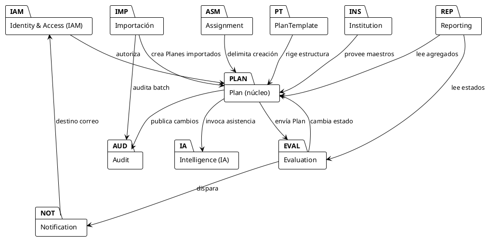

# Modelo de Dominio

**Sistema:** PTD — Planes de Trabajo Docentes (IE Las Palmas)
**Versión:** 1.0 · **Fecha:** Julio 2026
**SRS de referencia:** `01-requerimientos/SRS-IEEE-29148.md` · **Reglas de negocio:** `reglas-de-negocio.md`

> El modelo sigue DDD: *bounded contexts*, agregados, value objects y puertos. Se incluyen diagramas en PlantUML y un glosario de cada agregado con invariantes (reglas RN-###).

---

## 1. Bounded Contexts

| BC | Responsabilidad | Lenguaje ubicuo (Ɋ) |
|---|---|---|
| **Identity & Access (IAM)** | Identidad (proveída por el instituto), mapeo a usuarios PTD, roles, permisos. | Usuario, Rol, Permiso, Sesión |
| **Institution** | Maestros institucionales: años lectivos, periodos, grados, cursos, áreas, nodos, asignaturas y malla curricular. | AñoLectivo, Periodo, Grado, Curso, Area, Nodo, Asignatura |
| **Assignment** | Asignación de docentes a cursos/grados/asignaturas/periodos (con modo dupla). | DocenteAsignacion, Dupla |
| **PlanTemplate** | Plantillas versionables del Plan de Aula (secciones/subsecciones configurables). | Plantilla, Seccion, SubSeccion, Version |
| **Plan** *(núcleo)* | Plan de Aula, sus secciones, ejes/unidades, indicadores, seguimientos y DUA. | Plan, Encabezado, Competencia, Indicador, Eje, Actividad, Seguimiento, PautaDUA |
| **Evaluation** | Revisión/calificación/aprobación/rechazo/devolución por Coordinación; observaciones. | Evaluacion, Calificacion, Observacion, PautaDUACheck |
| **Intelligence** | `AIService`, prompts, configuración IA, invocaciones, trazabilidad IA. | AIService, PromptTemplate, LlamadaIA, PresupuestoIA |
| **Importación** | Carga Excel, validación, transformación, batches, reversión, validación superior. | ImportBatch, ImportJob, ReporteValidacion, ReglaValidacion |
| **Reporting** | KPIs, dashboards, exportaciones. | Indicador, SeriesKPI, Reporte |
| **Audit** | Auditoría de cambios, historial, diffs, redacción PII. | AuditLog, AuditEntry, Diff |
| **Notification** | Eventos de correo, plantillas de correo, despachador idempotente. | EventoNotificacion, PlantillaCorreo, Despacho |

*Relaciones inters BCs* (integración por **Anti-Corruption Layer / ACL** + eventos de dominio suscritos): p. ej. *Plan* publica `PlanEnviado` → consumen *Evaluation* y *Notification*.

---

## 2. Diagrama de contexto delimitado



---

## 3. Agregados principales

### 3.1 IAM — `Usuario` (aggregate root)

- `Usuario`
  - `id: UUID`
  - `documento: Documento` (VO; PII — se redacta en auditoría RN-110)
  - `nombre: NombreCompleto` (VO)
  - `email: Email` (VO)
  - `estado: UsuarioEstado = ACTIVO | INACTIVO` *(RN-102)*
  - `roles: Set<RolId>` *(RN-003)*
  - `permisosEfectivos(): Set<Permiso>` — Unión de permisos de roles
- Existencia externa: la identidad **proviene** del instituto. PTD no guarda contraseñas. *(RN-001)*

### 3.2 Institution — `AñoLectivo` (AR), `Grado`, `Curso`, `Area`, `Nodo`, `Asignatura`

- `AñoLectivo`
  - `id`, `nombre` (p. ej. "2026"), `activo: bool` *(RN-010)*
  - `periodos: List<Periodo>`
- `Periodo` (VO dentro de AñoLectivo)
  - `numero` (1..n), `nombre` ("1°", "2°", …), `fechaInicio`, `fechaCierre` *(RN-011)*
- `Grado` — `id`, `codigo` ("6°"), `nivel: PRIMARIA | SECUNDARIA | MEDIA` *(RN-012)*
- `Curso` — `id`, `codigo` ("6°1"), `edadId`, `gradoId`
- `Area` — `id`, `codigo`, `nombre`
- `Nodo` — `id`, `codigo`, `nombre`
- `Asignatura` — `id`, `codigo`, `nombre`, `areaId?`, `nodoId?` *(RN-013)*

### 3.3 Assignment — `DocenteAsignacion` (AR)

- `DocenteAsignacion`
  - `id`, `docenteId: UsuarioId`, `cursoIds: Set<CursoId>`, `gradoId`, `asignaturaId`, `periodoId`
  - `duplaCon: Set<UsuarioId>` (otros docentes que comparten el mismo Plan) *(RN-021)*
  - `vigente: bool` (rango de fechas o estadozięki) *(RN-020)*
- Invariante: solo roles COORDINACION/RECTOR crean esta asignación *(RN-022)*.

### 3.4 PlanTemplate — `Plantilla` (AR)

- `Plantilla`
  - `id`, `version` (semántica, p. ej. `v2026.1`)
  - `secciones: List<Seccion>` (ordenadas, con `obligatoria`, `activa`)
- `Seccion` (entidad dentro de AR Plantilla)
  - `id`, `clave` ("CARACTERIZACION", "COMPETENCIAS", "INDICADORES", "ACTIVIDADES", "SEGUIMIENTO_DOCENTE", "DUA", "SEGUIMIENTO_COORDINACION", "SEGUIMIENTO_PSICOPEDAGOGICO")
  - `subSecciones: List<SubSeccion>`, `obligatoria`, `orden`
- `SubSeccion`
  - `id`, `clave`, `tipoEntrada: TEXT_LONG | LISTA_NUM | CHECKLIST | TABLA | DUAGROUPS`

*Invariantes*: RN-030 (estructura base conservada), RN-031 (versionado no retroactivo).

### 3.5 Plan — `Plan` (AR, núcleo)

- `Plan` *(aggregate root)*
  - `id: UUID`
  - `anioLectivoId`, `periodoId`
  - `asignaturaId`, `nodoId?`, `areaId?`
  - `docentes: Set<UsuarioId>` (uno o más, admitiendo dupla) *(RN-021)*
  - `gradoId`, `cursoIds: Set<CursoId>` *(en plantilla "6°1 - 6°2")*
  - `encabezado: Encabezado` (VO; ver 3.5.1)
  - `estado: EstadoPlan` *(RN-040)*
  - `secciones: Map<ClaveSeccion, SeccionPlan>` *(RN-031 — versión ligada)*
  - `plantillaVersion: SemVer`
  - `origin: OrigenRegistro = MANUAL | IMPORTED` *(RN-075)*
  - `importBatchId?: UUID` *(RN-076)*
  - `metadatosAuditoria: MetadatosAuditoria` *(RN-076)*
  - `eventos: List<DomainEvent>` (no persistido como tal; publicado)

#### 3.5.1 `Encabezado` (VO)

- `docentes: List<NombreDocente>`
- `nodoAreaAsignatura: String`
- `fechaInicio: LocalDate`, `fechaCierre: LocalDate`
- `gradoTexto: String` (literal "6°1 - 6°2")
- `numeroSemanas: PositiveInt`
- `numeroClases: PositiveInt`
- `periodo: PeriodoRef`

#### 3.5.2 Secciones del Plan

- `Caracterizacion(Map<CursoId, TextoLargo>)` *(texto por grupo)*
- `Competencias`
  - `especificas: List<TextoEnumerado>` (1..n)
  - `socioEmocionales: List<TextoEnumerado>` (1..n)
- `Indicadores`
  - `conceptuales: List<Texto> + porcentaje: Percent` *(RN-041)*
  - `procedimentales: List<Texto> + porcentaje: Percent`
  - `actitudinales: List<Texto> + porcentaje: Percent`
- `Ejes` — `List<Eje>` (entidades dentro de Plan)
  - `Eje`:
    - `id`, `numero: NumeroEje`
    - `nombre` ("Eje temático / Unidad integradora / Dimensión")
    - `actividadInicio: TextoLargo`
    - `actividadNuevaInformacion: TextoLargo`
    - `actividadFinalizacion: TextoLargo`
    - `evaluacion: TextoLargo`
    - `criteriosValoracion: TextoLargo`
    - `numeroClasesAsignadas: PositiveInt` *(RN-041#3)*
    - `seguimientosPorGrupo: Map<CursoId, TextoLargo>` *(seguimiento doc. por grupo)*
    - `pautasDUA: Set<PautaDUA>` *(compromiso/representación/acción)*
- `Seguimientos`
  - `coordinacion: List<SeguimientoCoord>` *(1..N)*
  - `psicopedagogico: List<SeguimientoPsico>` *(1..N)*

#### 3.5.3 `MetadatosAuditoria` (VO, RN-076)

- `fechaCreacionOriginal?: Instant` (cuando proviene de Excel)
- `fechaCarga: Instant` (cuando ImportBatch creó el Plan)
- `fechaUltimaEdicion: Instant`
- `usuarioCargaId: UUID`
- `usuarioUltimaEdicionId: UUID`
- `usuarioValidacionId?: UUID` (batch approving)

#### 3.5.4 `PautaDUA` (VO enum)

- `COMPROMISO_CAPTAR_INTERES`
- `COMPROMISO_ESFUERZO_PERSISTENCIA`
- `COMPROMISO_AUTORREGULACION`
- `REPRESENTACION_PERCEPCION`
- `REPRESENTACION_LENGUAJE_SIMBOLOS`
- `REPRESENTACION_COMPRENSION`
- `ACCION_INTERACCION_FISICA`
- `ACCION_EXPRESION_COMUNICACION`
- `ACCION_FUNCIONES_EJECUTIVAS`

#### 3.5.5 `EstadoPlan` (enum), `OrigenRegistro` (enum), `NombreDocente`, `TextoLargo`

#### 3.5.6 Invariantes del Plan

- Solo se editar si `estado ∈ {BORRADOR, DEVUELTO}` *(RN-042)*.
- En `ENVIADO`, no editable salvo por coordinación (revisión) *(RN-042)*.
- Solo docente(s) pertenecientes a la asignación vigente pueden editar *(RN-020)*.
- En *Enviar* se validan los chequeos de RN-041.
- `origin` y `importBatchId` son **inmutables** *(RN-076, RN-078)*.

### 3.6 Evaluation — `Evaluacion` (AR)

- `Evaluacion`
  - `planId: UUID`
  - `calificacion: Calificacion` (VO; escala configurable, default 0..100)
  - `decision: Decision = APROBAR | RECHAZAR | DEVOLVER | EN_REVISION`
  - `observacion: TextoLargo?` *(RN-044 obligatoria en RECHAZO/DEVOLUCION)*
  - `pautasDUA: Set<PautaDUA>` *(checklist del coordinador)*
  - `responsableId: UUID` (coordinador) *(RN-043)*
  - `fecha: Instant`

> La `Evaluacion` cambia el `EstadoPlan` del agregado `Plan` por comando `DecidirEvaluacion`. El evento `PlanDecidido` → *Notification* dispara correo *(RN-090)*.

### 3.7 Intelligence — `AIService` (puerto), `ConfiguracionIA` (AR), `InvocacionIA` (entidad de log)

- `AIService` (interface de puerto, no de proveedor concreto)
  - `sugerir(prompt: PromptContext, opcion: AccionIA): Sugerencia`
  - `Acciones IA`: `BORRADOR | MEJORAR | CORREGIR_ORTOGRAFIA | ADAPTAR_PEDAGOGICO | RESUMIR | EXPANDIR | PROPONER_ACTIVIDADES | GENERAR_COMPETENCIAS | GENERAR_INDICADORES | GENERAR_OBSERVACIONES | PREGUNTAR_DILIGENCIAMIENTO`
- `ConfiguracionIA` (AR, una por ambiente):
  - `proveedor: string`, `modelo: string`, `temperatura: float`, `tokensMax: int`, `costoPorToken?: Money`
  - `prompts: Map<AccionIA, PromptTemplate>`
  - `limites: Map<RolUsuario, Limite>` (por usuario/día) *(RN-053)*
  - `permisosIA: Set<RolUsuario>` *(permiso granteable también)*
- `InvocacionIA` (log transaccional):
  - `id`, `usuarioId`, `timestamp`, `modelo`, `accionIA`, `campoDestino`, `tokensIn`, `tokensOut`, `costoEstimado`, `latenciaMs`, `resultado: ACEPTADO | EDITADO | RECHAZADO` *(RN-052)*

*Invariantes*: nadie fuera de `AIService` invoca al proveedor *(RN-051)*; PII redactada *(RN-054)*; cambio de proveedor aislado por un test de contrato *(RN-055)*.

### 3.8 Importación — `ImportBatch` (AR)

- `ImportBatch`
  - `id: UUID`, `archivoRef: StorageRef`, `nombreArchivo`, `hashSha256`, `tamanoBytes`
  - `usuarioCargaId: UUID` *(RN-070)*
  - `anioLectivoId`, `periodoId?`
  - `estado: EstadoBatch = PENDIENTE_VALIDACION | VALIDADO | RECHAZADO | REVERTIDO` *(RN-077)*
  - `reporteValidacion: ReporteValidacion`
  - `registros: List<RegistroImportado>`
  - `usuarioValidacionId?: UUID`, `fechaValidacion?: Instant`
  - `fechaCarga: Instant`
- `ReporteValidacion`
  - `errores: List<ErrorValidacion>` (bloqueantes)
  - `advertencias: List<AdvertenciaValidacion>`
  - `resumen: ResumenCarga` (por hoja: totalFilas, aceptadas, omitidas)
- `RegistroImportado`
  - `planId: UUID` (cuando se persiste el Plan creado)
  - `filaOrigen: int`, `hojaOrigen: String`, `novedades: List<String>`

*Invariantes*: validación previa obligatoria *(RN-071)*; solo `.xlsx` *(RN-072)*; persistencia transaccional *(RN-074)*; reversión no elimina *(RN-077)*.

### 3.9 Reporting — `Indicador` (väriks), `SeriesKPI`

- `Indicador` — `codigo`, `formulaTexto`, `parametros`, `cacheable`
- Definidos (Ej.):
  - `DOCENTES_PENDIENTES`, `DOCENTES_APROBADOS`, `PORCENTAJE_DILIGENCIADO`, `TIEMPO_PROMEDIO_DILIGENCIAMIENTO`, `CURSOS_PENDIENTES`, `GRADOS_PENDIENTES`
- `SeriesKPI` — puntos por dimensión (docente/periodo/grado/asignatura), versión hash de cálculo, CSV exportable *(RN-103, RN-104)*.

### 3.10 Audit — `AuditLog`

- `AuditEntry` — `id`, `correlacionId`, `timestamp`, `usuarioId`, `tipoOperacion`, `tipoEntidad`, `entidadId`, `diff: JSON (redactado)` *(RN-100, RN-101, RN-110)*. Insert-only.

### 3.11 Notification — `EventoNotificacion`

- `EventoNotificacion` — `id`, `tipo` (`OPEN_DILIGENCIAMIENTO`, …) *(RN-090)*, `payload`, `destinatarios`, `despachos: List<Despacho>`, `idempotencyKey`
- `Despacho` — `canal: CORREO | IN_APP`, `estado`, `fechaProgramada`, `fechaEnviada`, `transporteId`
- *Invariantes*: idempotencia con ventana *(RN-091)*; sin PII en asunto *(RN-092)*.

---

## 4. Eventos de dominio (resumen)

| Evento | Publicado por | Consumidores |
|---|---|---|
| `UsuarioCreado` | IAM | Audit, Notification |
| `PlanCreado` / `PlanEditado` / `PlanEnviado` | Plan | Audit, Notification |
| `PlanDecidido` (APROBADO/RECHAZADO/DEVOLVER) | Evaluation | Plan, Audit, Notification |
| `IAInvocada` | Intelligence | Audit, Reporting |
| `ImportBatchCreado` / `ImportBatchValidado` / `ImportBatchRechazado` / `ImportBatchRevertido` | Importación | Audit, Notification |
| `ThresholdAlcanzado` (p. ej. % diligenciado < x en fecha-limite) | Reporting | Notification (recordatorio) |

---

## 5. Diagrama de clases (núcleo Plan) — PlantUML

```plantuml
@startuml
!theme plain
skinparam classAttributeIconSize 0

class Plan {
  +id: UUID
  +estado: EstadoPlan
  +plantillaVersion: SemVer
  +origin: OrigenRegistro
  +importBatchId: UUID?
  +docentes: Set<UsuarioId>
  +encabezado: Encabezado
  +metadatos: MetadatosAuditoria
  -- invariantes --
  +editar(...): void
  +enviar(): void
  +versionNueva(): PlanVersion
}
class Encabezado <<VO>> {
  +docentes: List<NombreDocente>
  +fechaInicio: LocalDate
  +fechaCierre: LocalDate
  +gradoTexto: String
  +numeroSemanas: PositiveInt
  +numeroClases: PositiveInt
}
class SeccionPlan <<VO>> {
  +clave: ClaveSeccion
  +contenido: Contenido
}
class Eje {
  +numero: NumeroEje
  +nombre: String
  +actividadInicio: TextoLargo
  +actividadNuevaInformacion: TextoLargo
  +actividadFinalizacion: TextoLargo
  +evaluacion: TextoLargo
  +criteriosValoracion: TextoLargo
  +numeroClasesAsignadas: PositiveInt
  +seguimientosPorGrupo: Map<CursoId, TextoLargo>
  +pautasDUA: Set<PautaDUA>
}
class PautaDUA <<(E,enum)>>
class Evaluacion {
  +planId: UUID
  +decision: Decision
  +calificacion: Calificacion
  +observacion: TextoLargo?
  +pautasDUA: Set<PautaDUA>
  +responsableId: UUID
}
class ImportBatch {
  +id: UUID
  +estado: EstadoBatch
  +registros: List<RegistroImportado>
  +reporteValidacion: ReporteValidacion
}
class MetadatosAuditoria <<VO>> {
  +fechaCreacionOriginal: Instant?
  +fechaCarga: Instant
  +fechaUltimaEdicion: Instant
  +usuarioCargaId: UUID
  +usuarioUltimaEdicionId: UUID
  +usuarioValidacionId: UUID?
}

Plan "1" o-- "1" Encabezado
Plan "1" o-- "n" SeccionPlan
Plan "1" o-- "n" Eje
Eje "1" o-- "n" PautaDUA
Eje "1" o-- "n" :seguimientosPorGrupo
Plan "1" o-- "1" MetadatosAuditoria
Plan "1" <-- "0..n" Evaluacion
ImportBatch "1" --> "0..n" Plan : crea con origin=IMPORTED

@enduml
```

---

## 6. Conversaciones DDD — decisiones de diseño

1. **¿`PautaDUA` por Plan o por Eje?** → Por **Eje**, porque en la plantilla el seguimiento del coordinador se hace por eje/unidad/dimensión, y la guía del docente apunta a evidenciar DUA en cada eje.
2. **¿`Seguimientos` por Plan o por Eje?** → El seguimiento del **docente** va por Eje (evidencia de ejecución por unidad). El seguimiento de *Coordinación/Apoyo psico.* puede ser 1..N por Plan, en sus propias secciones, no ligados a un Eje.
3. **¿Dupla docente?** → `Plan.docentes: Set`, fomentada por `DocenteAsignacion.duplaCon`. *(RN-021)*
4. **¿Múltiples cursos por Plan?** → Sí; la plantilla admite "6°1 - 6°2". `Plan.cursoIds` permite más de uno; la caracterización y el seguimiento del docente se registran *por Curso*.
5. **¿Indicadores %?** → VO `Percent (0..100)`; en la plantilla son `Conceptuales 23`, `Procedimentales 23`, `Actitudinales 23`. Se generaliza para que la suma sea 100 % por defecto configurable desde `Plantilla`. *(RN-041#2)*
6. **¿Importación vs manual distinto modelo?** → Mismo agregado `Plan`; difieren en `origin`/`importBatchId`/`metadatos.fechaCreacionOriginal`. *(RN-075, RN-076, RN-078)*

---

## 7. Puertos y adaptadores (resumen)

| Puerto (interface, en aplicación) | Adaptadores concretos |
|---|---|
| `IdentityProvider` | `InforgeSsoIdentityAdapter`, `SpidAdapter` (mock) |
| `AIService` | `InforgeAIAdapter`, `OpenAiStubAdapter` (dev/test) |
| `PlanRepository` | `PostgresPlanRepository` |
| `ImportBatchRepository` | `PostgresImportRepository` |
| `ExcelReader` | `OpenXmlExcelReader` |
| `MailSender` | `SmtpMailAdapter` |
| `PdfRenderer` | `PdfServiceAdapter` |
| `AuditPublisher` | `PostgresAuditPublisher` |
| `NotificationBus` | `AsyncNotificationBus` |
| `Storage` (para archivos subidos) | `S3StorageAdapter`, `LocalStorageAdapter` |
| `Clock` | `SystemClock`, `FrozenClock` (test) |

*Fin del documento.*
