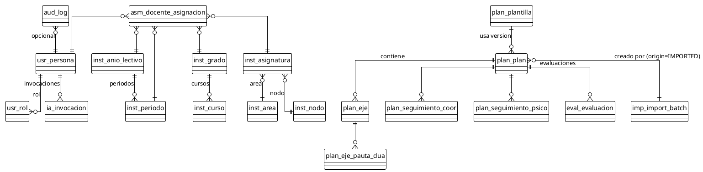

# Esquema de Base de Datos

**Sistema:** PTD — Planes de Trabajo Docentes (IE Las Palmas)
**Motor:** PostgreSQL 15+ (DDL portable con leves ajustes a otros RDBMS)
**Versión:** 1.0 · **Fecha:** Julio 2026
**SRS de referencia:** `01-requerimientos/SRS-IEEE-29148.md` · **Modelo:** `02-arquitectura/modelo-de-dominio.md` · **Reglas:** `01-requerimientos/reglas-de-negocio.md`

> Convenios: UUIDs PK. Borrado lógico (columna `activo`) en todas las tablas de dominio. Timestamps timestamptz en UTC. Audit: append-only (no UPDATE ni DELETE). JSONB para diffs estructurados. Esquema `ptd`.

---

## 1. Convenciones y prefijos

| Prefijo | Significado |
|---|---|
| `usr_` | Identidad/usuarios PTD |
| `inst_` | Maestros institucionales |
| `plan_` | Núcleo Plan de Aula y plantillas |
| `eval_` | Evaluación / decisión |
| `ia_` | Inteligencia |
| `imp_` | Importación |
| `aud_` | Auditoría |
| `rep_` | Reporting/KPIs (proyecciones) |
| `not_` | Notificaciones |

Mapeo de **Reglas de Negocio → campos/constraints** escrito como comentarios `-- RN-XXX`.

---

## 2. DDL

```sql
-- =========================================================
-- Esquema + extensiones
-- =========================================================
CREATE SCHEMA IF NOT EXISTS ptd;
SET search_path TO ptd;
CREATE EXTENSION IF NOT EXISTS "pgcrypto";        -- gen_random_uuid()
CREATE EXTENSION IF NOT EXISTS "citext";          -- emails case-insensitive

-- =========================================================
-- ENUMS
-- =========================================================
CREATE TYPE usuario_estado      AS ENUM ('ACTIVO', 'INACTIVO');
CREATE TYPE rol_codigo         AS ENUM ('RECTOR','COORDINACION','DOCENTE','APOYO_PSICOPEDAGOGICO','ADMIN_SISTEMA'); -- RN-003
CREATE TYPE plan_estado        AS ENUM ('BORRADOR','ENVIADO','EN_REVISION','APROBADO','RECHAZADO','DEVUELTO');       -- RN-040
CREATE TYPE plan_origen        AS ENUM ('MANUAL','IMPORTED');                                                       -- RN-075
CREATE TYPE batch_estado       AS ENUM ('PENDIENTE_VALIDACION','VALIDADO','RECHAZADO','REVERTIDO');                  -- RN-077
CREATE TYPE decision_eval      AS ENUM ('APROBAR','RECHAZAR','DEVOLVER','EN_REVISION');                              -- RN-044
CREATE TYPE pauta_dua          AS ENUM (
  'COMPROMISO_CAPTAR_INTERES','COMPROMISO_ESFUERZO_PERSISTENCIA','COMPROMISO_AUTORREGULACION',
  'REPRESENTACION_PERCEPCION','REPRESENTACION_LENGUAJE_SIMBOLOS','REPRESENTACION_COMPRENSION',
  'ACCION_INTERACCION_FISICA','ACCION_EXPRESION_COMUNICACION','ACCION_FUNCIONES_EJECUTIVAS'
);
CREATE TYPE accion_ia          AS ENUM (
  'BORRADOR','MEJORAR','CORREGIR_ORTOGRAFIA','ADAPTAR_PEDAGOGICO','RESUMIR','EXPANDIR',
  'PROPONER_ACTIVIDADES','GENERAR_COMPETENCIAS','GENERAR_INDICADORES','GENERAR_OBSERVACIONES',
  'PREGUNTAR_DILIGENCIAMIENTO'
);
CREATE TYPE ia_resultado       AS ENUM ('ACEPTADO','EDITADO','RECHAZADO');
CREATE TYPE evento_notif       AS ENUM ('OPEN_DILIGENCIAMIENTO','RECORDATORIO','RETRASO','LLAMADO_ATENCION','APROBADO','RECHAZADO','DEVUELTO'); -- RN-090
CREATE TYPE seccion_clave     AS ENUM ('CARACTERIZACION','COMPETENCIAS','INDICADORES','ACTIVIDADES','SEGUIMIENTO_DOCENTE','DUA','SEGUIMIENTO_COORDINACION','SEGUIMIENTO_PSICOPEDAGOGICO');

-- =========================================================
-- IAM
-- =========================================================
CREATE TABLE usr_persona (
  id              uuid PRIMARY KEY DEFAULT gen_random_uuid(),
  documento       varchar(32)  NOT NULL UNIQUE,
  nombre          varchar(120) NOT NULL,
  apellido        varchar(120),
  email           citext      NOT NULL UNIQUE,
  estado          usuario_estado NOT NULL DEFAULT 'ACTIVO',
  activo          boolean      NOT NULL DEFAULT TRUE,        -- RN-102 borrado lógico
  fecha_creacion  timestamptz  NOT NULL DEFAULT now(),
  creado_por      uuid         NOT NULL,
  fecha_modif     timestamptz  NOT NULL DEFAULT now(),
  modificado_por  uuid         NOT NULL,
  CONSTRAINT chk_persona_doc CHECK (documento <> '')
);

CREATE TABLE usr_rol (
  id     smallserial PRIMARY KEY,
  codigo rol_codigo NOT NULL UNIQUE,
  nombre varchar(80) NOT NULL,
  descripcion text
);

CREATE TABLE usr_permiso (
  id     smallserial PRIMARY KEY,
  codigo varchar(64) NOT NULL UNIQUE,
  descripcion text
);

CREATE TABLE usr_rol_permiso (
  rol_id     smallint NOT NULL REFERENCES usr_rol(id),
  permiso_id smallint NOT NULL REFERENCES usr_permiso(id),
  PRIMARY KEY (rol_id, permiso_id)
);

CREATE TABLE usr_persona_rol (
  persona_id uuid NOT NULL REFERENCES usr_persona(id),
  rol_id     smallint NOT NULL REFERENCES usr_rol(id),
  PRIMARY KEY (persona_id, rol_id)
);

CREATE TABLE usr_persona_permiso_extra (
  persona_id uuid    NOT NULL REFERENCES usr_persona(id),
  permiso_id smallint NOT NULL REFERENCES usr_permiso(id),
  PRIMARY KEY (persona_id, permiso_id)
);

-- =========================================================
-- INSTITUTION
-- =========================================================
CREATE TABLE inst_anio_lectivo (
  id            uuid PRIMARY KEY DEFAULT gen_random_uuid(),
  nombre        varchar(20) NOT NULL UNIQUE,
  activo        boolean NOT NULL DEFAULT FALSE,            -- RN-010 a lo sumo uno activo
  fecha_inicio  date NOT NULL,
  fecha_cierre  date NOT NULL,
  CONSTRAINT chk_anio_fechas CHECK (fecha_cierre >= fecha_inicio)
);
-- Reinar un solo activo mediante partial unique index
CREATE UNIQUE INDEX uq_anio_unico_activo ON inst_anio_lectivo (activo) WHERE activo;

CREATE TABLE inst_periodo (
  id            uuid PRIMARY KEY DEFAULT gen_random_uuid(),
  anio_id       uuid NOT NULL REFERENCES inst_anio_lectivo(id),
  numero        smallint NOT NULL,
  nombre        varchar(12) NOT NULL,                       -- "1°", "2°"
  fecha_inicio  date NOT NULL,
  fecha_cierre  date NOT NULL,
  CONSTRAINT chk_periodo_num CHECK (numero > 0),
  CONSTRAINT chk_periodo_fechas CHECK (fecha_cierre >= fecha_inicio),
  UNIQUE (anio_id, numero),
  UNIQUE (anio_id, nombre)
);

CREATE TABLE inst_nivel (
  id smallserial PRIMARY KEY,
  codigo varchar(16) NOT NULL UNIQUE  -- 'PRIMARIA','SECUNDARIA','MEDIA'
);

CREATE TABLE inst_grado (
  id      uuid PRIMARY KEY DEFAULT gen_random_uuid(),
  codigo  varchar(16) NOT NULL,    -- '6°'
  nivel_id smallint NOT NULL REFERENCES inst_nivel(id),
  activo  boolean NOT NULL DEFAULT TRUE,
  UNIQUE (codigo, nivel_id)
);

CREATE TABLE inst_curso (
  id       uuid PRIMARY KEY DEFAULT gen_random_uuid(),
  codigo   varchar(24) NOT NULL,  -- '6°1'
  grado_id uuid NOT NULL REFERENCES inst_grado(id),
  activo   boolean NOT NULL DEFAULT TRUE,
  UNIQUE (codigo, grado_id)
);

CREATE TABLE inst_area (
  id     uuid PRIMARY KEY DEFAULT gen_random_uuid(),
  codigo varchar(16) NOT NULL UNIQUE,
  nombre varchar(120) NOT NULL,
  activo boolean NOT NULL DEFAULT TRUE
);

CREATE TABLE inst_nodo (
  id     uuid PRIMARY KEY DEFAULT gen_random_uuid(),
  codigo varchar(16) NOT NULL UNIQUE,
  nombre varchar(120) NOT NULL,
  activo boolean NOT NULL DEFAULT TRUE
);

CREATE TABLE inst_asignatura (
  id      uuid PRIMARY KEY DEFAULT gen_random_uuid(),
  codigo  varchar(24) NOT NULL,
  nombre  varchar(160) NOT NULL,
  area_id uuid REFERENCES inst_area(id),
  nodo_id uuid REFERENCES inst_nodo(id),
  activo  boolean NOT NULL DEFAULT TRUE,
  CONSTRAINT chk_asig_jerarquia CHECK (area_id IS NOT NULL OR nodo_id IS NOT NULL),    -- RN-013
  UNIQUE (codigo)
);

-- =========================================================
-- ASSIGNMENT (RN-020, RN-021, RN-022)
-- =========================================================
CREATE TABLE asm_docente_asignacion (
  id           uuid PRIMARY KEY DEFAULT gen_random_uuid(),
  docente_id   uuid NOT NULL REFERENCES usr_persona(id),
  anio_id      uuid NOT NULL REFERENCES inst_anio_lectivo(id),
  periodo_id   uuid NOT NULL REFERENCES inst_periodo(id),
  grado_id     uuid NOT NULL REFERENCES inst_grado(id),
  asignatura_id uuid NOT NULL REFERENCES inst_asignatura(id),
  vigente      boolean NOT NULL DEFAULT TRUE,
  fecha_desde  date NOT NULL,
  fecha_hasta  date,
  creado_por   uuid NOT NULL REFERENCES usr_persona(id),
  CONSTRAINT chk_asm_fechas CHECK (fecha_hasta IS NULL OR fecha_hasta >= fecha_desde),
  UNIQUE (docente_id, anio_id, periodo_id, grado_id, asignatura_id)
);

CREATE TABLE asm_docente_asignacion_curso (
  asignacion_id uuid NOT NULL REFERENCES asm_docente_asignacion(id) ON DELETE CASCADE,
  curso_id      uuid NOT NULL REFERENCES inst_curso(id),
  PRIMARY KEY (asignacion_id, curso_id)
);

-- Dupla: dos asignaciones linkeadas como dupla (RN-021)
CREATE TABLE asm_dupla (
  id          uuid PRIMARY KEY DEFAULT gen_random_uuid(),
  asignacion_a uuid NOT NULL REFERENCES asm_docente_asignacion(id),
  asignacion_b uuid NOT NULL REFERENCES asm_docente_asignacion(id),
  creado_por   uuid NOT NULL REFERENCES usr_persona(id),
  fecha        timestamptz NOT NULL DEFAULT now(),
  CONSTRAINT chk_dupla_diff CHECK (asignacion_a <> asignacion_b),
  UNIQUE (asignacion_a, asignacion_b)
);

-- =========================================================
-- PLANTILLA (RN-030, RN-031)
-- =========================================================
CREATE TABLE plan_plantilla (
  id        uuid PRIMARY KEY DEFAULT gen_random_uuid(),
  version   varchar(20) NOT NULL,   -- semver: v2026.1
  activa    boolean NOT NULL DEFAULT FALSE,
  creada    timestamptz NOT NULL DEFAULT now(),
  creada_por uuid NOT NULL REFERENCES usr_persona(id),
  UNIQUE (version)
);
CREATE UNIQUE INDEX uq_plantilla_unica_activa ON plan_plantilla (activa) WHERE activa;

CREATE TABLE plan_seccion (
  id            uuid PRIMARY KEY DEFAULT gen_random_uuid(),
  plantilla_id  uuid NOT NULL REFERENCES plan_plantilla(id) ON DELETE CASCADE,
  clave         seccion_clave NOT NULL,
  orden         smallint NOT NULL,
  obligatoria   boolean NOT NULL DEFAULT TRUE,
  activa        boolean NOT NULL DEFAULT TRUE,
  UNIQUE (plantilla_id, clave)
);

CREATE TABLE plan_subseccion (
  id           uuid PRIMARY KEY DEFAULT gen_random_uuid(),
  seccion_id   uuid NOT NULL REFERENCES plan_seccion(id) ON DELETE CASCADE,
  clave        varchar(64) NOT NULL,
  tipo_entrada varchar(24) NOT NULL,        -- TEXT_LONG|LISTA_NUM|CHECKLIST|TABLA|DUAGROUPS
  obligatoria  boolean NOT NULL DEFAULT TRUE,
  orden        smallint NOT NULL,
  UNIQUE (seccion_id, clave)
);

-- =========================================================
-- PLAN (núcleo)
-- =========================================================
CREATE TABLE plan_plan (
  id                  uuid PRIMARY KEY DEFAULT gen_random_uuid(),
  anio_id             uuid NOT NULL REFERENCES inst_anio_lectivo(id),
  periodo_id          uuid NOT NULL REFERENCES inst_periodo(id),
  asignatura_id       uuid NOT NULL REFERENCES inst_asignatura(id),
  -- area_id/nodo_id implícito por asignatura FK; opcionalmente cache nullable:
  area_id             uuid REFERENCES inst_area(id),
  nodo_id             uuid REFERENCES inst_nodo(id),
  grado_id            uuid NOT NULL REFERENCES inst_grado(id),
  plantilla_id        uuid NOT NULL REFERENCES plan_plantilla(id),
  version_plantilla   varchar(20) NOT NULL,            -- RN-031 ligado
  estado              plan_estado NOT NULL DEFAULT 'BORRADOR',
  origen              plan_origen  NOT NULL DEFAULT 'MANUAL',  -- RN-075
  import_batch_id     uuid REFERENCES imp_import_batch(id),    -- RN-076
  -- Metadatos de auditoría (RN-076)
  fecha_creacion_original timestamptz,                 -- si procede de Excel
  fecha_carga             timestamptz NOT NULL DEFAULT now(),
  fecha_ultima_edicion    timestamptz NOT NULL DEFAULT now(),
  usuario_carga_id        uuid NOT NULL REFERENCES usr_persona(id),
  usuario_ultima_edicion_id uuid NOT NULL REFERENCES usr_persona(id),
  usuario_validacion_id   uuid REFERENCES usr_persona(id),
  -- Encabezado
  docentes_texto       varchar(400) NOT NULL,         -- "Carolina Saldarriaga - Elizabeth Zuluaga"
  nodo_area_asignatura varchar(400) NOT NULL,
  fecha_inicio         date NOT NULL,
  fecha_cierre         date NOT NULL,
  grado_texto          varchar(120) NOT NULL,         -- "6°1 - 6°2"
  num_semanas          smallint  NOT NULL CHECK (num_semanas > 0),
  num_clases           smallint  NOT NULL CHECK (num_clases > 0),
  CONSTRAINT chk_plan_fechas CHECK (fecha_cierre >= fecha_inicio),
  CONSTRAINT chk_plan_import_origin CHECK (
     (origen = 'IMPORTED' AND import_batch_id IS NOT NULL) OR
     (origen = 'MANUAL'   AND import_batch_id IS NULL)
  )
);
-- Un solo Planvigente por (anio, periodo, asignatura, docente/grado) — modelado con índice:
CREATE UNIQUE INDEX uq_plan_unico_persona_periodo
  ON plan_plan (anio_id, periodo_id, asignatura_id, grado_id);

CREATE TABLE plan_docente (                         -- varios docentes (dupla) por Plan
  plan_id    uuid NOT NULL REFERENCES plan_plan(id) ON DELETE CASCADE,
  persona_id uuid NOT NULL REFERENCES usr_persona(id),
  PRIMARY KEY (plan_id, persona_id)
);

CREATE TABLE plan_curso (                            -- varios cursos por Plan (6°1,6°2)
  plan_id  uuid NOT NULL REFERENCES plan_plan(id) ON DELETE CASCADE,
  curso_id uuid NOT NULL REFERENCES inst_curso(id),
  PRIMARY KEY (plan_id, curso_id)
);

-- SECCIONES (cada una se mapea de forma específica)
CREATE TABLE plan_caracterizacion (                  -- por curso
  plan_id    uuid NOT NULL REFERENCES plan_plan(id) ON DELETE CASCADE,
  curso_id   uuid NOT NULL REFERENCES inst_curso(id),
  texto      text NOT NULL,
  PRIMARY KEY (plan_id, curso_id)
);

CREATE TABLE plan_competencia (
  id        uuid PRIMARY KEY DEFAULT gen_random_uuid(),
  plan_id   uuid NOT NULL REFERENCES plan_plan(id) ON DELETE CASCADE,
  tipo      varchar(24) NOT NULL CHECK (tipo IN ('ESPECIFICA','SOCIOEMOCIONAL')),
  orden     smallint NOT NULL,
  texto     text NOT NULL
);

CREATE TABLE plan_indicador (
  id              uuid PRIMARY KEY DEFAULT gen_random_uuid(),
  plan_id         uuid NOT NULL REFERENCES plan_plan(id) ON DELETE CASCADE,
  categoria       varchar(20) NOT NULL CHECK (categoria IN ('CONCEPTUAL','PROCEDIMENTAL','ACTITUDINAL')),
  porcentaje      numeric(5,2) NOT NULL DEFAULT 0,   -- RN-041#2 (suma configurable)
  texto           text NOT NULL
);

CREATE TABLE plan_eje (                              -- lista por Plan
  id                  uuid PRIMARY KEY DEFAULT gen_random_uuid(),
  plan_id             uuid NOT NULL REFERENCES plan_plan(id) ON DELETE CASCADE,
  numero              smallint NOT NULL,
  nombre              varchar(200) NOT NULL,
  act_inicio          text NOT NULL,
  act_nueva_info      text NOT NULL,
  act_finalizacion    text NOT NULL,
  evaluacion          text NOT NULL,
  criterios_valoracion text NOT NULL,
  num_clases          smallint NOT NULL CHECK (num_clases >= 0),   -- RN-041#3
  UNIQUE (plan_id, numero)
);

CREATE TABLE plan_eje_seguimiento_docente (          -- text por grupo (curso)
  eje_id    uuid NOT NULL REFERENCES plan_eje(id) ON DELETE CASCADE,
  curso_id  uuid NOT NULL REFERENCES inst_curso(id),
  texto     text NOT NULL,
  PRIMARY KEY (eje_id, curso_id)
);

CREATE TABLE plan_eje_pauta_dua (                    -- checklist DUA por Eje
  eje_id      uuid NOT NULL REFERENCES plan_eje(id) ON DELETE CASCADE,
  pauta       pauta_dua NOT NULL,
  PRIMARY KEY (eje_id, pauta)
);

CREATE TABLE plan_seguimiento_coor (                 -- 1..N por Plan
  id            uuid PRIMARY KEY DEFAULT gen_random_uuid(),
  plan_id       uuid NOT NULL REFERENCES plan_plan(id) ON DELETE CASCADE,
  responsable_id uuid NOT NULL REFERENCES usr_persona(id),
  fecha         date NOT NULL,
  observacion   text NOT NULL,
  pautas        pauta_dua[] DEFAULT '{}',
  creado_en     timestamptz NOT NULL DEFAULT now()
);

CREATE TABLE plan_seguimiento_psico (                -- 1..N por Plan
  id            uuid PRIMARY KEY DEFAULT gen_random_uuid(),
  plan_id       uuid NOT NULL REFERENCES plan_plan(id) ON DELETE CASCADE,
  responsable_id uuid NOT NULL REFERENCES usr_persona(id),
  fecha         date NOT NULL,
  texto         text NOT NULL,
  creado_en     timestamptz NOT NULL DEFAULT now()
);

CREATE TABLE plan_version (                          -- RN-017 historial versiones
  id            bigserial PRIMARY KEY,
  plan_id       uuid NOT NULL REFERENCES plan_plan(id) ON DELETE CASCADE,
  numero        int NOT NULL,
  snapshot      jsonb NOT NULL,                       -- plan serializado
  usuario_id    uuid NOT NULL REFERENCES usr_persona(id),
  fecha         timestamptz NOT NULL DEFAULT now(),
  motivo        text,
  UNIQUE (plan_id, numero)
);

-- =========================================================
-- EVALUATION
-- =========================================================
CREATE TABLE eval_evaluacion (
  id            uuid PRIMARY KEY DEFAULT gen_random_uuid(),
  plan_id       uuid NOT NULL REFERENCES plan_plan(id),
  decision      decision_eval NOT NULL,
  calificacion  numeric(5,2) NOT NULL DEFAULT 0,
  observacion   text,
  responsable_id uuid NOT NULL REFERENCES usr_persona(id),
  fecha         timestamptz NOT NULL DEFAULT now(),
  pautas        pauta_dua[] DEFAULT '{}',
  CONSTRAINT chk_eval_obs_req CHECK (
     (decision IN ('RECHAZAR','DEVOLVER')) = (observacion IS NOT NULL AND observacion <> '')   -- RN-044
  )
);
CREATE INDEX idx_eval_plan ON eval_evaluacion (plan_id, fecha DESC);

-- =========================================================
-- INTELLIGENCE (IA)  (RN-050 .. RN-055)
-- =========================================================
CREATE TABLE ia_configuracion (
  id            smallserial PRIMARY KEY,
  activa        boolean NOT NULL DEFAULT TRUE,
  proveedor     varchar(64) NOT NULL,           -- configurado vía Inforge.dev
  modelo        varchar(64) NOT NULL,
  temperatura   numeric(3,2) NOT NULL DEFAULT 0.20 CHECK (temperatura >= 0 AND temperatura <= 2),
  tokens_max    int NOT NULL DEFAULT 1024 CHECK (tokens_max > 0),
  costo_por_token numeric(18,10) DEFAULT 0,
  creado_en     timestamptz NOT NULL DEFAULT now(),
  actualizado_en timestamptz NOT NULL DEFAULT now()
);

CREATE TABLE ia_prompt_template (
  id           uuid PRIMARY KEY DEFAULT gen_random_uuid(),
  config_id    smallint NOT NULL REFERENCES ia_configuracion(id),
  accion       accion_ia NOT NULL,
  plantilla    text NOT NULL,
  variables    jsonb NOT NULL DEFAULT '{}',
  UNIQUE (config_id, accion)
);

CREATE TABLE ia_limite (
  config_id    smallint NOT NULL REFERENCES ia_configuracion(id),
  rol          rol_codigo NOT NULL,
  max_invocaciones_dia int NOT NULL CHECK (max_invocaciones_dia > 0),
  PRIMARY KEY (config_id, rol)
);

CREATE TABLE ia_invocacion (                         -- RN-052 log IA
  id            bigserial PRIMARY KEY,
  usuario_id    uuid NOT NULL REFERENCES usr_persona(id),
  fecha         timestamptz NOT NULL DEFAULT now(),
  config_id     smallint NOT NULL REFERENCES ia_configuracion(id),
  accion        accion_ia NOT NULL,
  modelo        varchar(64) NOT NULL,
  campo_destino varchar(120),
  plan_id       uuid REFERENCES plan_plan(id),
  tokens_in     int NOT NULL DEFAULT 0,
  tokens_out    int NOT NULL DEFAULT 0,
  costo_estimado numeric(18,10) NOT NULL DEFAULT 0,
  latencia_ms   int NOT NULL DEFAULT 0,
  resultado     ia_resultado NOT NULL,
  prompt_hash   varchar(64)                          -- RN-110 PII no se almacena
);
CREATE INDEX idx_ia_invocacion_fecha ON ia_invocacion (fecha DESC);
CREATE INDEX idx_ia_invocacion_user ON ia_invocacion (usuario_id, fecha DESC);

-- =========================================================
-- IMPORTACIÓN (RN-070 .. RN-078)
-- =========================================================
CREATE TABLE imp_import_batch (
  id                    uuid PRIMARY KEY DEFAULT gen_random_uuid(),
  nombre_archivo        varchar(255) NOT NULL,
  storage_ref           varchar(512) NOT NULL,        -- ubicación del .xlsx
  sha256                varchar(64) NOT NULL,
  tamano_bytes          bigint NOT NULL CHECK (tamano_bytes > 0),
  estado                batch_estado NOT NULL DEFAULT 'PENDIENTE_VALIDACION',  -- RN-077
  usuario_carga_id      uuid NOT NULL REFERENCES usr_persona(id),
  usuario_validacion_id uuid REFERENCES usr_persona(id),
  fecha_carga           timestamptz NOT NULL DEFAULT now(),
  fecha_validacion      timestamptz,
  anio_id               uuid NOT NULL REFERENCES inst_anio_lectivo(id),
  periodo_id            uuid REFERENCES inst_periodo(id),   -- opcional si archivo traía varios periodos
  reporte_validacion    jsonb NOT NULL DEFAULT '{}',        -- ResumenCarga (aceptados/omitidos/errores/advertencias)
  CHECK (estado IN ('PENDIENTE_VALIDACION','VALIDADO','RECHAZADO','REVERTIDO'))
);
CREATE INDEX idx_imp_batch_estado ON imp_import_batch (estado);

CREATE TABLE imp_registro_importado (
  id              uuid PRIMARY KEY DEFAULT gen_random_uuid(),
  batch_id        uuid NOT NULL REFERENCES imp_import_batch(id) ON DELETE CASCADE,
  plan_id         uuid REFERENCES plan_plan(id),
  hoja_origen     varchar(16) NOT NULL,   -- "1°", "2°", ...
  fila_origen     int NOT NULL,
  novedades       text[] DEFAULT '{}'
);
CREATE INDEX idx_imp_reg_batch ON imp_registro_importado (batch_id);

-- =========================================================
-- AUDIT (RN-100, RN-101, RN-110) — APPEND-ONLY
-- =========================================================
CREATE TABLE aud_log (
  id              bigserial PRIMARY KEY,
  correlacion_id  uuid,
  fecha           timestamptz NOT NULL DEFAULT now(),
  usuario_id      uuid REFERENCES usr_persona(id),    -- NULL para eventos del sistema
  tipo_operacion  varchar(32) NOT NULL,               -- CREATE|UPDATE|DELETE|SEND|DECIDE|IMPORT|REVERT|IA
  tipo_entidad    varchar(48) NOT NULL,               -- 'Plan','ImportBatch',...
  entidad_id      uuid,
  diff            jsonb NOT NULL DEFAULT '{}',        -- JSON con {antes,después} redactado de PII
  ip_origen       inet,
  user_agent      varchar(255)
);
CREATE INDEX idx_aud_entidad ON aud_log (tipo_entidad, entidad_id, fecha DESC);
CREATE INDEX idx_aud_usuario ON aud_log (usuario_id, fecha DESC);
-- Restricción append-only: revocar UPDATE/DELETE a roles de aplicación via GRANT:
-- GRANT INSERT, SELECT ON aud_log TO ptd_app;
-- (No GRANT UPDATE/DELETE)

-- =========================================================
-- NOTIFICATION (RN-090 .. RN-092)
-- =========================================================
CREATE TABLE not_evento (
  id              uuid PRIMARY KEY DEFAULT gen_random_uuid(),
  tipo            evento_notif NOT NULL,
  payload         jsonb NOT NULL DEFAULT '{}',
  fecha           timestamptz NOT NULL DEFAULT now(),
  idempotency_key varchar(80) NOT NULL,
  UNIQUE (idempotency_key)
);

CREATE TABLE not_despacho (
  id           bigserial PRIMARY KEY,
  evento_id    uuid NOT NULL REFERENCES not_evento(id) ON DELETE CASCADE,
  receptor_id  uuid REFERENCES usr_persona(id),
  receptor_email citext,
  canal        varchar(16) NOT NULL CHECK (canal IN ('CORREO','IN_APP')),
  estado       varchar(20) NOT NULL DEFAULT 'PENDIENTE',  -- PENDIENTE|ENVIADO|FALLIDO|
  fecha_programada timestamptz,
  fecha_envada     timestamptz,
  transporte_id    varchar(120)
);
CREATE INDEX idx_not_despacho_estado ON not_despacho (estado, fecha_programada);

-- =========================================================
-- REPORTING PROJECTION (CQRS) — opcional, para dashboards
-- =========================================================
CREATE TABLE rep_plan_resumen (
  plan_id           uuid PRIMARY KEY REFERENCES plan_plan(id) ON DELETE CASCADE,
  anio_id           uuid NOT NULL,
  periodo_id        uuid NOT NULL,
  grado_id          uuid NOT NULL,
  asignatura_id     uuid NOT NULL,
  estado            plan_estado NOT NULL,
  docente_id        uuid,                          -- primer docente (representativo)
  porcentaje_completado numeric(5,2) NOT NULL DEFAULT 0,
  num_clases        int NOT NULL DEFAULT 0,
  dias_desde_envio  int,
  ultima_edicion    timestamptz
);
CREATE INDEX idx_rep_resumen_filtros ON rep_plan_resumen (anio_id, periodo_id, grado_id, estado);
```

---

## 3. Tablas e índices de seguimiento**

| Tabla | Propósito | RN |
|---|---|---|
| `imp_import_batch.reporte_validacion` | JSON con `errores`, `advertencias`, `resumenCarga` | RN-071 |
| `plan_plan.fecha_ultima_edicion` | Audit de última edición | RN-076 |
| `plan_version` | Snapshot versionado del Plan | RN-017, RN-082 |
| `aud_log` | Append-only | RN-100 |
| `ia_invocacion` | Log uso IA | RN-052 |

---

## 4. Invariantes clave (a nivel de BD cuando es posible)

- **RN-010** Solo un `inst_anio_lectivo.activo = TRUE` ⇒ índice `uq_anio_unico_activo`.
- **RN-013** `inst_asignatura.chk_asig_jerarquia`.
- **RN-040/041** Validaciones de porcentaje/`num_clases` se ejecutan en app (Aggregate `Plan.enviar()`); la BD aporta constraints base.
- **RN-044** `eval_evaluacion.chk_eval_obs_req`.
- **RN-075/076** `plan_plan.chk_plan_import_origin` + columnas de auditoría.
- **RN-100** `aud_log` append-only vía GRANT (permisos de app sin UPDATE/DELETE).
- **RN-102** `activo` boolean + borrados lógicos en entidades maestras.

> Las invariantes de comportamiento complejo (RN-040/041, RN-071 detalladas por fila, RN-074 transaccional, RN-091 idempotencia) se garantizan en la **capa de dominio/aplicación**, no exclusivamente en la BD.

---

## 5. Almacenamiento de archivos

- Los `.xlsx` cargados se almacenan en un **object storage externo** (S3-compatible o equivalente) con inmutabilidad/retención por política. Se persiste en `imp_import_batch.storage_ref`.
- Los PDFs exportados no se persisten por defecto (se generan on-demand), salvo auditoría que los requiera explícitamente.

---

## 6. Separación de datos IA (RD-001, RN-120)

- **BD relacional transaccional** ⇒ todos los datos operativos/administrativos descritos aquí.
- **Inforge.dev** ⇒ almacenamiento y consulta de **embeddings/datos vectoriales** cuando se aplique RAG, semántica y personalización de respuestas IA. Se accede **únicamente** desde el adaptador `InforgeAIAdapter` que implementa el puerto `AIService`. El dominio/aplicación **no** conocen el almacén vectorial.

---

## 7. Diagrama ER simplificado (PlantUML)



---

## 8. Estrategia de migración y seed

- **Migraciones**: versionadas (p. ej., Flyway/Liquibase). Cada DDL en archivo bajo `db/migrations/V__n.sql`.
- **Seed**: rol/permiso estándar (RN-003), nivel educativo (`PRIMARIA`,`SECUNDARIA`,`MEDIA`), permisos base (`excel.import`, `ia.use`, `plantilla.manage`, `malla.manage`, `personas.manage`, `evaluacion.decide`, …). El seed `0.1-permisos.sql` crea las tuplas `usr_rol`/`usr_permiso`.

---

## 9. Notas finales

- Las **tablas de proyección** (p. ej. `rep_plan_resumen`) son辅助tables actualizadas por proyeccionista (event-suscriptor o job periódico). Son CQRS-Lectura.
- **No** se exponen vistas/funciones de lectura de IA desde el dominio; `ia_invocacion` está en la BD relacional (separación lógica claro vía esquema `ptd`).
- Los campos PII (`usr_persona.documento`) deben ser cifrados en reposo si el instituto lo requiere; la redacción en diffs/logs es obligatoria *(RN-110)*.

*Fin del documento.*
